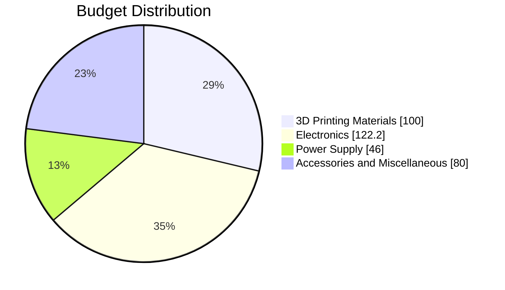

# Budget

## Cost Overview

The Spring-Mass Analyzer was designed with a low-cost philosophy, aiming to provide an accessible experimental platform for educational and research applications.

### Estimated Total Cost

!!! info "Project Cost"
    **Estimated Total Cost:** R$ 348.20

---

## Budget Distribution

---

## Category Summary

| Category | Cost (R$) | Percentage |
|-----------|-----------:|-----------:|
| 3D Printing Materials | 100.00 | 28.7% |
| Electronics | 122.20 | 35.1% |
| Power Supply | 46.00 | 13.2% |
| Accessories and Miscellaneous | 80.00 | 23.0% |
| **Total** | **348.20** | **100%** |

---

## Detailed Cost Breakdown

| Component | Quantity | Unit Cost (R$) | Total Cost (R$) |
|------------|------------|------------:|------------:|
| ABS Filament | 1 | 100.00 | 100.00 |
| ESP32 | 1 | 45.00 | 45.00 |
| GP2Y0A41YK0F Distance Sensor | 1 | 50.00 | 50.00 |
| LCD 16x2 Display with I2C | 1 | 23.00 | 23.00 |
| Push Buttons | 3 | 1.40 | 4.20 |
| Jumper Wires Kit | 1 | 30.00 | 30.00 |
| Battery Holder | 1 | 6.00 | 6.00 |
| 18650 Batteries | 2 | 12.50 | 25.00 |
| Battery Charger Module | 1 | 15.00 | 15.00 |
| Miscellaneous Components | — | 50.00 | 50.00 |
| **Total** |  |  | **348.20** |

---

## Cost Analysis

### 3D Printing Materials

- ABS filament required for structural components.
- Prototype enclosure manufacturing.
- Sensor support structures.

### Electronics

- ESP32 microcontroller.
- Distance sensor.
- LCD display.
- Interface buttons.

### Power Supply

- Battery holder.
- Rechargeable batteries.
- Charging module.

### Accessories and Miscellaneous

- Jumper wires.
- Connectors.
- Fasteners.
- Unexpected replacement parts.

---

## Budget Considerations

!!! note "Future Cost Reduction"
    The final production version may reduce costs through:
    
    - Bulk component purchases.
    - PCB integration.
    - Optimized 3D printing.
    - Alternative sensor options.

!!! success "Project Goal"
    The complete system remains below **R$ 350.00**, fulfilling the project's low-cost objective.