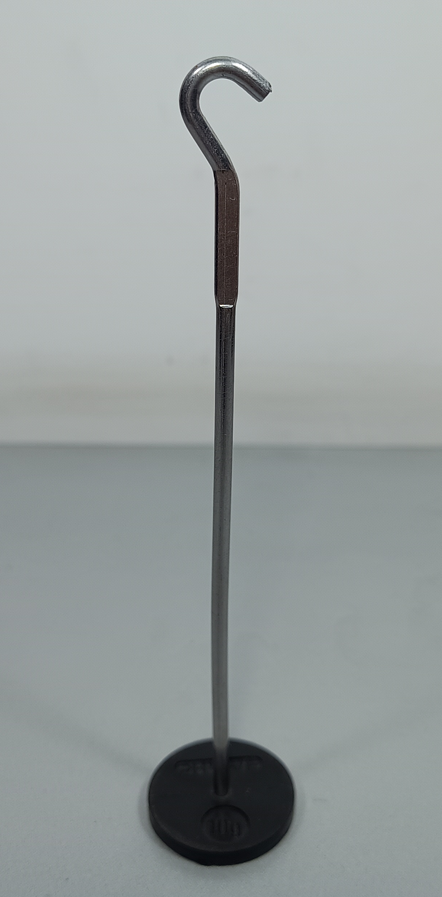

# Experiment Setup

Esta seção apresenta a montagem do sistema massa-mola utilizado nas medições com o Spring-Mass Collector.

---

## Materiais do experimento

Utilize uma estrutura de suporte, uma mola, o disco refletor e um conjunto de massas.

{ width="450" }

O suporte com gancho é utilizado para prender as massas abaixo do disco refletor.

{ width="320" }

Escolha uma mola compatível com a massa utilizada e com a amplitude desejada.

{ width="450" }

---

## 1. Prepare a estrutura

Monte a estrutura com duas hastes verticais e uma haste horizontal superior.

{ width="450" }

A haste horizontal deve ficar firme, pois será o ponto de sustentação da mola.

---

## 2. Fixe a mola

Prenda a mola no centro da haste horizontal.

{ width="450" }

A mola deve ficar aproximadamente vertical e livre para oscilar sem tocar nas hastes laterais.

---

## 3. Prenda o disco refletor

Conecte o disco refletor à extremidade inferior da mola.

{ width="450" }

O disco deve ficar centralizado e aproximadamente horizontal.

{ width="360" }

!!! warning "Alinhamento"
    Evite inclinação ou rotação excessiva do disco, pois isso pode prejudicar a leitura do sensor.

---

## 4. Adicione o suporte de massas

Passe o suporte de massas pelo centro do disco e conecte-o ao conjunto preso à mola.

{ width="450" }

A massa deve ficar abaixo do disco, mantendo o movimento predominantemente vertical.

{ width="360" }

---

## 5. Posicione o Spring-Mass Collector

Coloque a caixa coletora abaixo do disco, com o sensor apontado para sua superfície inferior.

Ajuste a altura do coletor até que o disco permaneça dentro da faixa útil do sensor durante toda a oscilação.

!!! note "Faixa de medição"
    O sensor Sharp GP2Y0A41SK0F deve operar com o disco aproximadamente entre 4 cm e 30 cm de distância.

---

## 6. Calibre e colete os dados

Com a massa em repouso:

1. ligue o Spring-Mass Collector;
2. entre no modo de calibração;
3. registre a posição inicial;
4. desloque levemente a massa;
5. solte sem aplicar força lateral;
6. inicie a coleta.

---

## Checklist

Antes de iniciar a medição, verifique se:

- a estrutura está firme;
- a mola está presa no centro da haste;
- o disco está horizontal;
- a massa está bem fixada;
- o disco não toca no sensor;
- a oscilação ocorre dentro da faixa de leitura;
- o sistema foi calibrado com a massa em repouso.