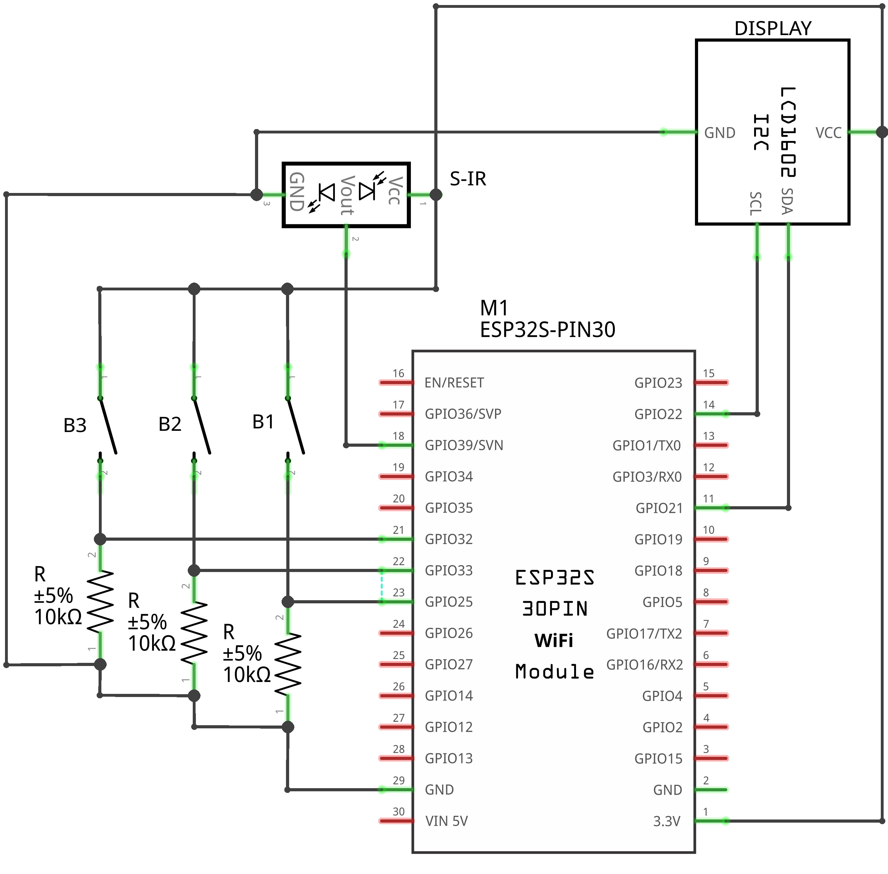
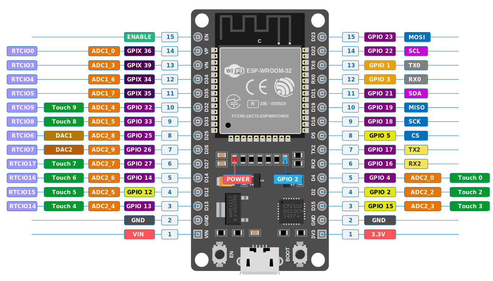

# Schematic

O esquema elétrico do Spring-Mass Collector apresenta as conexões entre o microcontrolador ESP32, o sensor infravermelho de distância, o display LCD com interface I²C e os três botões utilizados para controlar o equipamento.

O ESP32 atua como elemento central do circuito. Ele recebe o sinal analógico do sensor, interpreta os comandos dos botões, atualiza o display e realiza a transferência dos dados por Bluetooth.

---

## Esquema elétrico geral

<figure markdown>
  

  <figcaption>
    Esquema elétrico geral contendo o ESP32, o sensor infravermelho, o display LCD e os três botões.
  </figcaption>
</figure>

Os componentes principais do circuito são:

| Identificação | Componente                 | Função                              |
| ------------- | -------------------------- | ----------------------------------- |
| M1            | ESP32 DevKit de 30 pinos   | processamento e controle do sistema |
| S-IR          | sensor infravermelho       | medição da distância                |
| DISPLAY       | LCD 16×2 com interface I²C | apresentação das informações        |
| B1            | botão 1                    | seleção e controle de funções       |
| B2            | botão 2                    | seleção e controle de funções       |
| B3            | botão 3                    | seleção e controle de funções       |

---

## Microcontrolador

O projeto utiliza uma placa ESP32 DevKit baseada no módulo ESP-WROOM-32.

<figure markdown>
  

  <figcaption>
    Distribuição dos pinos da placa ESP32 DevKit utilizada no projeto.
  </figcaption>
</figure>

A ESP32 é responsável por:

* ler a saída analógica do sensor;
* calcular a distância;
* determinar a posição relativa;
* detectar o acionamento dos botões;
* atualizar o display;
* armazenar as amostras;
* transmitir os dados por Bluetooth;
* executar as tarefas do firmware.

Os pinos utilizados no projeto são:

| Função                    | Pino da ESP32                            |
| ------------------------- | ---------------------------------------- |
| Saída analógica do sensor | `GPIO39`                                 |
| Botão B1                  | `GPIO25`                                 |
| Botão B2                  | `GPIO33`                                 |
| Botão B3                  | `GPIO32`                                 |
| Comunicação I²C — SDA     | `GPIO21`                                 |
| Comunicação I²C — SCL     | `GPIO22`                                 |
| Alimentação do display    | `3.3V` ou tensão compatível com o módulo |
| Alimentação do sensor     | `3.3V`                                 |
| Referência elétrica comum | `GND`                                    |

!!! note "GPIO39"
O `GPIO39` é utilizado apenas como entrada. Essa característica é adequada para a leitura da saída analógica do sensor de distância.

---

## Alimentação do circuito

Todos os componentes precisam compartilhar a mesma referência elétrica.

Os pinos de terra devem ser conectados ao `GND` da ESP32:

* terra do sensor;
* terra do display;
* terminais de referência dos botões;
* demais módulos adicionados ao circuito.

!!! warning "Terra comum"
Sem uma conexão comum de `GND`, as tensões dos sinais não possuem a mesma referência e o circuito pode apresentar leituras instáveis ou deixar de funcionar.

A placa pode ser alimentada por sua conexão USB. A linha `VIN/5V` pode ser utilizada para fornecer a tensão necessária ao sensor infravermelho.

---

## Sensor infravermelho

O sensor utilizado é o Sharp GP2Y0A41SK0F.

Ele possui três conexões:

| Terminal do sensor | Conexão           |
| ------------------ | ----------------- |
| `VCC`              | `3.3V` da ESP32 |
| `GND`              | `GND` da ESP32    |
| `VOUT`             | `GPIO39`          |

O terminal `VOUT` fornece uma tensão analógica que varia de acordo com a distância entre o sensor e o disco refletor.

A ESP32 converte essa tensão em um valor digital por meio do conversor analógico-digital.

!!! warning "Alimentação do sensor"
O sensor GP2Y0A41SK0F deve ser alimentado pela linha de 5 V. A conexão de seu terminal `VCC` diretamente ao pino de 3,3 V não corresponde à alimentação nominal utilizada por esse sensor.

A saída do sensor permanece conectada ao `GPIO39`, utilizado pelo firmware para realizar as leituras.

---

## Display LCD

O sistema utiliza um display LCD 16×2 com módulo de comunicação I²C.

Esse módulo reduz a quantidade de fios necessários, pois a comunicação utiliza apenas duas linhas de sinal:

| Terminal do display | Conexão                             |
| ------------------- | ----------------------------------- |
| `SDA`               | `GPIO21`                            |
| `SCL`               | `GPIO22`                            |
| `GND`               | `GND`                               |
| `VCC`               | alimentação compatível com o módulo |

O terminal `SDA` transporta os dados, enquanto o terminal `SCL` fornece o sinal de sincronização da comunicação.

### Alimentação do display

No esquema fornecido, o display aparece conectado à linha de 3,3 V.

Essa ligação deve ser mantida somente quando o módulo I²C e o display funcionarem corretamente nessa tensão.

Alguns módulos LCD 16×2 são projetados para operar em 5 V. Nesse caso, também deve ser verificado se as linhas I²C possuem resistores de pull-up conectados a 5 V.

!!! warning "Níveis lógicos do I²C"
Os pinos da ESP32 operam com níveis lógicos de 3,3 V. As linhas `SDA` e `SCL` não devem ser elevadas diretamente a 5 V. Caso o módulo utilize pull-ups para 5 V, deve-se adaptar o circuito ou utilizar um conversor de nível lógico.

---

## Botões

Os três botões realizam o controle da interface do equipamento:

| Botão | Pino     |
| ----- | -------- |
| B1    | `GPIO25` |
| B2    | `GPIO33` |
| B3    | `GPIO32` |

O firmware atual utiliza os resistores internos de pull-up da ESP32 por meio de:

```cpp
pinMode(BUTTON_1_PIN, INPUT_PULLUP);
pinMode(BUTTON_2_PIN, INPUT_PULLUP);
pinMode(BUTTON_3_PIN, INPUT_PULLUP);
```

Por isso, cada botão deve ser conectado entre seu respectivo GPIO e o `GND`.

| Estado do botão | Nível lógico lido |
| --------------- | ----------------- |
| não pressionado | `HIGH`            |
| pressionado     | `LOW`             |

A ligação recomendada é:

| Terminal                | Conexão  |
| ----------------------- | -------- |
| primeiro terminal de B1 | `GPIO25` |
| segundo terminal de B1  | `GND`    |
| primeiro terminal de B2 | `GPIO33` |
| segundo terminal de B2  | `GND`    |
| primeiro terminal de B3 | `GPIO32` |
| segundo terminal de B3  | `GND`    |

!!! warning "Diferença em relação ao esquema anexado"
O esquema anexado apresenta resistores externos de 10 kΩ em configuração pull-down, com os botões conectando os GPIOs à alimentação positiva. Essa configuração produz nível `HIGH` quando o botão é pressionado.

```
O firmware atual utiliza `INPUT_PULLUP`, portanto os botões devem ser conectados ao `GND` e ficam ativos em nível `LOW`. As duas configurações não devem ser utilizadas simultaneamente.
```

---

## Correção do circuito dos botões

Para manter o circuito compatível com o firmware atual:

1. conecte B1 entre `GPIO25` e `GND`;
2. conecte B2 entre `GPIO33` e `GND`;
3. conecte B3 entre `GPIO32` e `GND`;
4. remova os resistores externos de 10 kΩ;
5. mantenha os pinos configurados como `INPUT_PULLUP`.

Os resistores internos da ESP32 mantêm os GPIOs em nível alto enquanto os botões estão abertos.

Quando um botão é pressionado, seu GPIO é conectado ao terra e passa para nível baixo.

---

## Resumo das conexões

| Componente           | Terminal   | ESP32 ou alimentação           |
| -------------------- | ---------- | ------------------------------ |
| Sensor infravermelho | `VCC`      | `VIN/5V`                       |
| Sensor infravermelho | `GND`      | `GND`                          |
| Sensor infravermelho | `VOUT`     | `GPIO39`                       |
| Display LCD          | `VCC`      | tensão compatível com o módulo |
| Display LCD          | `GND`      | `GND`                          |
| Display LCD          | `SDA`      | `GPIO21`                       |
| Display LCD          | `SCL`      | `GPIO22`                       |
| Botão B1             | sinal      | `GPIO25`                       |
| Botão B1             | referência | `GND`                          |
| Botão B2             | sinal      | `GPIO33`                       |
| Botão B2             | referência | `GND`                          |
| Botão B3             | sinal      | `GPIO32`                       |
| Botão B3             | referência | `GND`                          |

---

## Fluxo dos sinais

O funcionamento elétrico pode ser resumido da seguinte forma:

1. o sensor mede a distância até o disco refletor;
2. a saída analógica é enviada ao `GPIO39`;
3. a ESP32 converte a leitura em distância;
4. os botões enviam comandos aos `GPIO25`, `GPIO33` e `GPIO32`;
5. a ESP32 atualiza o display pelos pinos `GPIO21` e `GPIO22`;
6. os dados são armazenados e posteriormente transmitidos por Bluetooth.

---

## Cuidados durante a montagem

Antes de energizar o circuito, verifique:

* polaridade do sensor;
* polaridade da alimentação do display;
* conexão comum de `GND`;
* continuidade dos fios;
* ausência de curto-circuitos;
* conexão correta dos botões;
* ausência de fios soltos;
* tensão aplicada ao sensor;
* tensão aplicada ao módulo I²C;
* isolamento das conexões.

!!! danger "Curto-circuito"
Não conecte diretamente os pinos `3.3V`, `VIN/5V` ou sinais GPIO ao `GND`. Um curto-circuito pode danificar a placa, o cabo USB ou a fonte de alimentação.

---

## Teste inicial

O circuito deve ser testado antes do fechamento da caixa.

A sequência recomendada é:

1. energizar somente a ESP32;
2. verificar se a placa inicia corretamente;
3. conectar e testar o display;
4. testar individualmente os três botões;
5. conectar o sensor;
6. observar as leituras pela comunicação serial;
7. verificar se a distância varia corretamente;
8. testar todos os modos do sistema;
9. organizar os fios;
10. fechar a caixa.

!!! tip "Teste por etapas"
A conexão de um componente por vez facilita a identificação de erros. Caso todo o circuito seja montado antes do primeiro teste, torna-se mais difícil localizar uma ligação incorreta.
