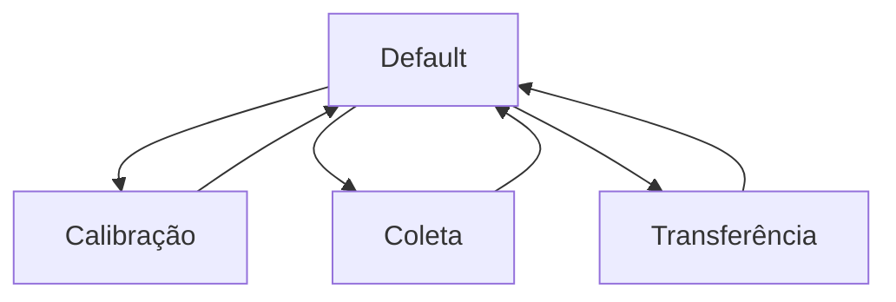

# How the System Works

O **Spring-Mass Collector** funciona como um sistema embarcado de aquisição, armazenamento, exibição e transferência de dados experimentais.

A ideia central é medir a posição de uma massa oscilante, calcular seu deslocamento relativo em relação a uma posição inicial calibrada e armazenar esses dados ao longo do tempo para análise posterior.

---

## Fluxo geral de funcionamento

O funcionamento do sistema pode ser resumido pelo seguinte fluxo:

```text
Sensor mede a distância atual
        ↓
ESP32 converte a leitura analógica em distância
        ↓
Sistema compara a distância atual com a posição inicial
        ↓
Deslocamento relativo é calculado
        ↓
Tempo e posição são armazenados
        ↓
LCD exibe informações resumidas
        ↓
Dados são transferidos por Bluetooth
```

Esse fluxo permite transformar o movimento de uma massa oscilante em uma série temporal de dados experimentais.

---

## Medição da distância

O sistema utiliza um sensor infravermelho de distância para medir a separação entre o sensor e a massa do sistema massa-mola.

A leitura feita pelo sensor é uma medida de distância absoluta. Isso significa que o sensor não mede diretamente o deslocamento da massa em relação ao equilíbrio, mas sim a distância entre o sensor e o objeto detectado.

De forma simplificada:

```text
Sensor infravermelho
        ↓
Distância até a massa
        ↓
Leitura analógica na ESP32
```

A ESP32 lê o sinal analógico fornecido pelo sensor e converte essa leitura em uma distância em centímetros.

---

## Posição inicial de referência

Em um experimento massa-mola, geralmente o dado de interesse não é a distância absoluta entre o sensor e a massa, mas sim o deslocamento da massa em relação a uma posição de equilíbrio.

Por isso, antes da coleta de dados, o sistema realiza uma calibração inicial. Durante essa etapa, a posição atual da massa é registrada como posição de referência.

Essa posição inicial é representada por:

```text
x₀
```

Depois da calibração, o sistema passa a calcular o deslocamento relativo da massa.

---

## Cálculo da posição relativa

A posição relativa é calculada comparando a distância medida em cada instante com a posição inicial calibrada.

Matematicamente:

[
x_{rel}(t) = x(t) - x_0
]

onde:

| Símbolo      | Descrição                                     |
| ------------ | --------------------------------------------- |
| (x(t))       | distância medida pelo sensor em cada instante |
| (x_0)        | posição inicial definida na calibração        |
| (x_{rel}(t)) | deslocamento relativo da massa                |

No firmware, essa lógica é equivalente a:

```cpp
latestRelativePositionCm = latestDistanceCm - initialPositionCm;
```

Assim, se a massa se afasta do sensor em relação à posição inicial, o deslocamento relativo assume um sinal. Se ela se aproxima, assume o sinal oposto.

!!! note "Distância absoluta e posição relativa"
O sensor mede uma distância absoluta. O sistema converte essa medida em posição relativa para que o dado final seja mais adequado à análise do movimento massa-mola.

---

## Armazenamento dos dados

Durante a coleta, o sistema armazena pares de tempo e posição.

Cada ponto experimental possui a forma:

```text
tempo, posição
```

No firmware, cada ponto pode ser representado conceitualmente por:

```cpp
struct DataPoint {
  uint32_t time_ms;
  float position_cm;
};
```

A primeira variável armazena o tempo desde o início da coleta. A segunda armazena a posição relativa da massa em centímetros.

O formato final dos dados transferidos é:

```text
t_ms,pos_cm
```

Um exemplo de saída é:

```text
t_ms,pos_cm
25,0.0123
50,0.0181
75,0.0204
100,0.0195
END
```

---

## Exibição no LCD

O display LCD 16x2 I2C apresenta informações resumidas sobre o estado do sistema.

Durante a operação, ele pode mostrar:

* modo atual;
* posição relativa medida;
* quantidade de dados armazenados;
* estado da coleta;
* status de transferência;
* aviso de memória cheia.

O LCD não precisa exibir todos os pontos coletados. Ele serve como uma interface local para orientar o usuário durante o experimento.

!!! warning "Taxa de atualização do LCD"
O LCD é mais lento do que a aquisição do sensor. Por isso, a tela deve ser atualizada em uma frequência menor do que a taxa real de armazenamento dos dados.

Essa separação evita que a atualização da interface prejudique a regularidade da coleta.

---

## Controle por botões

O sistema utiliza três botões físicos para controlar os modos de operação.

Cada botão pode assumir uma função diferente dependendo do modo atual. Por exemplo, um mesmo botão pode iniciar a calibração no menu principal, mas pausar a coleta durante o modo de aquisição.

Essa lógica depende de uma máquina de estados implementada no firmware.

```text
Botão pressionado
        ↓
Sistema identifica o modo atual
        ↓
Função correspondente é executada
```

Esse comportamento permite controlar todo o sistema usando poucos elementos físicos.

---

## Modos de operação

O funcionamento lógico da caixa é organizado em quatro modos principais:

| Modo          | Função                                 |
| ------------- | -------------------------------------- |
| Default       | apresenta o menu principal             |
| Calibração    | define a posição inicial de referência |
| Coleta        | registra tempo e posição               |
| Transferência | envia os dados armazenados             |

Essa estrutura facilita o uso do equipamento e também torna o firmware mais organizado.



---

## Transferência por Bluetooth

Após a coleta, os dados armazenados podem ser enviados por Bluetooth para um dispositivo externo.

Nos testes do projeto, foi utilizado o aplicativo **Serial Bluetooth Terminal**, que permite receber os dados enviados pela ESP32 e salvá-los em arquivo `.txt`.

A transferência é feita em texto simples, no formato:

```text
t_ms,pos_cm
```

Esse formato facilita a importação dos dados em programas de análise como Python, Excel, MATLAB, Mathematica, Origin ou ferramentas semelhantes.

!!! note "Terminal Bluetooth"
O Serial Bluetooth Terminal foi utilizado nos testes, mas o sistema pode ser usado com outros aplicativos ou programas capazes de receber dados via Bluetooth Serial.

---

## Arquitetura geral do sistema

O sistema pode ser dividido em três camadas principais:

<div class="grid cards" markdown>

* :material-access-point:{ .lg .middle } **Aquisição**

  ---

  Leitura do sensor infravermelho, conversão da leitura analógica e cálculo da posição relativa.

* :material-memory:{ .lg .middle } **Armazenamento**

  ---

  Registro dos pares `t_ms,pos_cm` em memória durante a coleta experimental.

* :material-bluetooth:{ .lg .middle } **Transferência**

  ---

  Envio dos dados armazenados para um dispositivo externo por comunicação Bluetooth.

</div>

Além dessas camadas, o sistema possui uma interface local formada pelo LCD 16x2 I2C e pelos botões físicos.

---

## Relação com o experimento massa-mola

O dado final produzido pelo Spring-Mass Collector é uma série temporal da posição relativa da massa:

$$
x_{rel}(t)
$$

Essa série pode ser usada para construir gráficos de posição em função do tempo e estudar características do movimento oscilatório, como período, frequência, amplitude e decaimento da oscilação.

Em um experimento de oscilador amortecido, os dados coletados podem ser comparados com modelos teóricos do tipo:

$$
x(t) = A e^{-\gamma t}\cos(\omega_d t + \phi)
$$

O sistema não realiza automaticamente esse ajuste. Sua função principal é fornecer os dados experimentais de forma organizada para que a análise seja feita externamente.

---

## Resumo do funcionamento

De forma resumida, o Spring-Mass Collector executa o seguinte ciclo:

```text
1. Usuário calibra a posição inicial.
2. Sensor mede a distância até a massa.
3. ESP32 calcula o deslocamento relativo.
4. Sistema armazena tempo e posição.
5. LCD mostra o estado da coleta.
6. Usuário transfere os dados por Bluetooth.
7. Dados são analisados externamente.
```

Esse fluxo transforma um experimento visual e manual em um procedimento quantitativo, automático e mais reprodutível.
