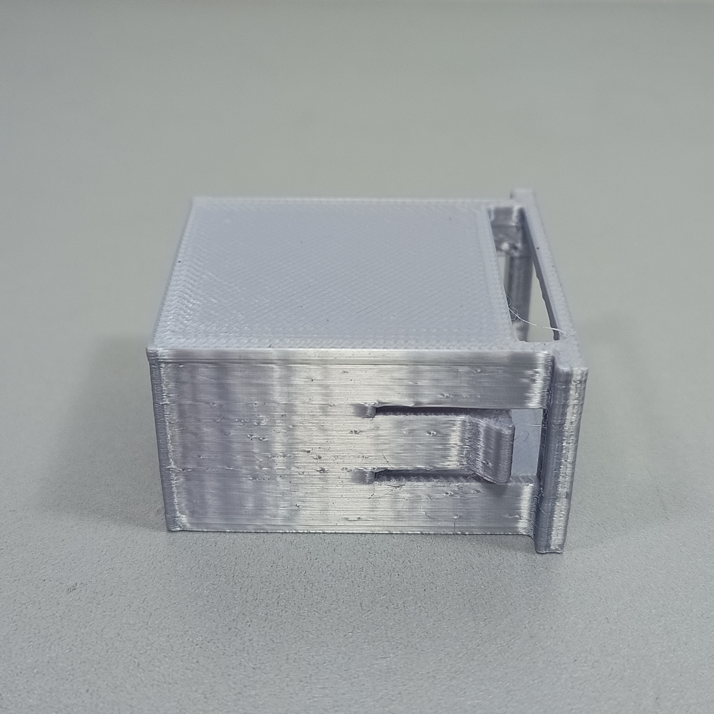

# 3D Printed Parts

As peças impressas em 3D do Spring-Mass Collector foram projetadas para acomodar o sistema eletrônico, permitir o ajuste da altura do sensor e integrar o equipamento ao experimento massa-mola.

O conjunto é formado por:

* caixa;
* suporte base;
* suporte intermediário;
* suporte superior;
* suporte do sensor;
* disco refletor.

Cada peça possui uma geometria associada à sua função mecânica. Além do formato, a orientação utilizada durante a impressão influencia diretamente a resistência dos suportes e o funcionamento das travas.

---

## Caixa

A caixa constitui o corpo principal do Spring-Mass Collector e foi projetada para acomodar todo o sistema eletrônico com as menores dimensões externas possíveis.

Seu volume interno considera o espaço necessário para:

* microcontrolador;
* display LCD;
* botões;
* fios e conectores;
* elementos de fixação;
* montagem e manutenção dos componentes.

A redução das dimensões externas facilita o transporte e o posicionamento do equipamento, mas deve preservar espaço suficiente para evitar que fios e conectores sejam pressionados.

### Inclinação do display

A região frontal da caixa possui uma inclinação de aproximadamente 30°.

Essa inclinação melhora a visualização do display quando o equipamento está apoiado sobre uma mesa ou bancada. Como o usuário normalmente observa a caixa de uma posição mais elevada, uma superfície completamente horizontal dificultaria a leitura.

A inclinação também permite operar os botões e acompanhar as informações exibidas sem movimentar a caixa durante a coleta.

### Abertura lateral

A lateral esquerda possui uma abertura alinhada à conexão do microcontrolador.

Essa abertura permite:

* alimentar o equipamento;
* conectar o microcontrolador ao computador;
* carregar o firmware;
* realizar testes pela comunicação serial;
* acessar a conexão sem desmontar a caixa.

O posicionamento lateral mantém o cabo afastado da região do display e dos botões.

!!! note "Dimensões internas"
A caixa deve possuir espaço suficiente para acomodar os componentes e permitir a organização dos fios. Uma redução excessiva das dimensões pode dificultar a montagem e aplicar esforços sobre os conectores.

---

## Suporte base

O suporte base conecta a caixa ao sistema extensível e estabelece o alinhamento inicial das peças superiores.

A geometria inclui:

* encaixe com a caixa;
* região de deslizamento do suporte intermediário;
* travas mecânicas;
* barra inferior para condução dos fios.

### Travas mecânicas

As travas são integradas à própria peça e mantêm a extensão na altura selecionada.

Quando os dois lados são pressionados simultaneamente, as regiões flexíveis se deslocam e liberam o movimento. Ao interromper a pressão, elas retornam à posição inicial e travam novamente o suporte.

Esse mecanismo reduz a quantidade de componentes adicionais, evitando o uso de pinos ou parafusos para selecionar a altura.

### Guia dos fios

A barra localizada na região inferior funciona como guia para os fios que conectam o sensor ao sistema eletrônico.

Sua função é manter os fios:

* próximos à estrutura;
* afastados das travas;
* direcionados para a caixa;
* organizados durante o ajuste da extensão.

!!! warning "Passagem dos fios"
Os fios não devem atravessar a região de movimento das travas. Um fio preso entre os suportes pode impedir o travamento ou ser danificado durante o ajuste da altura.

---

## Suporte intermediário

O suporte intermediário aumenta o alcance vertical da estrutura.

Sua geometria permite o encaixe entre o suporte base e o suporte superior, mantendo as peças aproximadamente alinhadas durante o ajuste de altura.

Assim como o suporte base, ele possui travas mecânicas integradas. Essas travas impedem que a estrutura deslize livremente após a seleção de um nível.

A peça foi projetada para combinar:

* resistência longitudinal;
* flexibilidade localizada nas travas;
* encaixe com os suportes adjacentes;
* passagem interna dos fios.

A flexibilidade deve permanecer concentrada nas travas. O corpo principal deve apresentar rigidez suficiente para evitar inclinações na parte superior da estrutura.

---

## Suporte superior

O suporte superior forma o último estágio do sistema extensível.

Ele possui:

* encaixe com o suporte intermediário;
* travas mecânicas para manter a extensão;
* passagem para os fios;
* região destinada à fixação do suporte do sensor.

O mecanismo de travamento segue o mesmo princípio utilizado nos suportes anteriores, mantendo uma operação semelhante em todos os níveis da extensão.

### Fixação do suporte do sensor

Na parte superior existe um ponto destinado ao parafusamento do suporte do sensor.

A fixação por parafuso foi utilizada porque a extremidade superior da estrutura precisa manter o sensor firmemente posicionado. Uma conexão apenas por encaixe poderia permitir folgas, inclinações ou movimentações durante o experimento.

!!! warning "Aperto do parafuso"
O parafuso deve ser apertado somente até eliminar a movimentação entre as peças. Um aperto excessivo pode deformar a região impressa ou danificar a rosca.

---

## Suporte do sensor

O suporte do sensor é fixado ao suporte superior por meio de um parafuso.

Sua geometria foi projetada para manter unidas as partes localizadas na extremidade da estrutura e conservar a posição do sensor durante a coleta.

O suporte deve:

* sustentar o sensor;
* limitar sua movimentação;
* manter sua orientação;
* permitir a passagem dos fios;
* manter livre a região frontal de medição;
* permanecer firmemente conectado ao suporte superior.

O parafusamento comprime e estabiliza o conjunto, reduzindo a possibilidade de alteração da orientação do sensor.

---

## Disco refletor

O disco refletor acompanha o movimento do sistema massa-mola e funciona como alvo para o sensor de distância.

A peça foi desenvolvida considerando três características principais:

* simetria;
* integração com o sistema de trava;
* facilidade de impressão.

### Construção simétrica

A geometria do disco é distribuída de forma simétrica em torno de seu eixo central.

Essa escolha reduz o desequilíbrio de massa e diminui a tendência de:

* inclinação;
* rotação;
* movimento lateral;
* oscilação pendular;
* desalinhamento em relação ao sensor.

Uma distribuição irregular de massa poderia introduzir movimentos que não fazem parte do modelo unidimensional do experimento.

### Estrutura de trava

O disco possui uma estrutura de trava com comportamento elástico.

Durante o encaixe, a região flexível se deforma e retorna à sua posição, mantendo as partes conectadas. Esse princípio reduz a necessidade de elementos externos de fixação.

A trava deve apresentar flexibilidade suficiente para permitir o encaixe, mas também resistência para manter o conjunto unido durante as oscilações.

### Geometria para impressão

A região destinada à conexão com a massa foi posicionada acima do disco.

Essa organização favorece a fabricação da peça ao:

* melhorar o apoio sobre a mesa;
* reduzir regiões suspensas;
* diminuir a necessidade de material de suporte;
* preservar a geometria da trava;
* facilitar o acabamento após a impressão.

---

## Orientação de impressão

A orientação de impressão influencia a resistência das peças produzidas por deposição de material.

Os seguintes suportes devem ser impressos deitados:

* suporte base;
* suporte intermediário;
* suporte superior.

<figure markdown>
  

  <figcaption>
    Orientação recomendada para a impressão das peças de suporte.
  </figcaption>
</figure>

### Suportes base, intermediário e superior

Os três suportes devem ser posicionados com o maior comprimento aproximadamente paralelo à mesa de impressão.

Essa orientação:

* aumenta a resistência longitudinal;
* melhora a resistência das travas;
* reduz a possibilidade de separação entre camadas;
* distribui melhor os esforços de flexão;
* aumenta a área de contato com a mesa.

A impressão vertical pode concentrar os esforços entre as camadas, principalmente nas travas e nas regiões flexíveis.

### Suporte do sensor

O suporte do sensor deve seguir a orientação mostrada na imagem, priorizando:

* estabilidade na mesa;
* precisão do encaixe;
* qualidade da região de parafusamento;
* passagem livre dos fios;
* redução do uso de suportes.

## Cuidados durante o fatiamento

Antes de iniciar a impressão, deve-se verificar:

* contato adequado da peça com a mesa;
* posição das travas;
* necessidade de suportes;
* preservação das passagens de fios;
* qualidade prevista para os encaixes;
* orientação das camadas nas regiões flexíveis.

O material de suporte, quando utilizado, não deve preencher ou bloquear as travas e as regiões internas de encaixe.

!!! warning "Regiões flexíveis"
As travas fazem parte do funcionamento mecânico das peças. Uma orientação inadequada ou uma baixa adesão entre camadas pode provocar sua quebra durante os primeiros usos.

---

## Inspeção após a impressão

Antes da montagem, verifique:

* presença de trincas;
* separação entre camadas;
* deformações;
* obstrução das passagens;
* funcionamento das travas;
* qualidade dos encaixes;
* integridade das regiões de parafusamento;
* resíduos de material de suporte.

As travas devem ser movimentadas inicialmente com cuidado. Caso estejam presas, deve-se verificar a presença de excesso de material antes de aplicar força.

---

## Ajustes pós-impressão

Pequenos ajustes podem ser necessários devido às tolerâncias da impressora.

As regiões que podem exigir acabamento são:

* superfícies de encaixe;
* furos para parafusos;
* passagens de fios;
* bordas com excesso de material;
* áreas que receberam material de suporte.

A remoção de material deve ser gradual. Um desgaste excessivo pode criar folgas permanentes e comprometer o alinhamento da estrutura.

!!! danger "Modificação das travas"
Não remova material das travas sem identificar previamente o ponto que impede seu movimento. Alterações excessivas podem eliminar o mecanismo de travamento.

---

## Relação entre projeto e impressão

O funcionamento das peças depende da combinação entre:

* geometria do modelo;
* orientação de impressão;
* adesão entre camadas;
* precisão dimensional;
* acabamento;
* montagem correta.

A orientação de impressão deve ser considerada parte do projeto mecânico, pois determina como as camadas resistirão aos esforços presentes nas travas e nos suportes.

---

## Próxima etapa

Após imprimir e inspecionar todas as peças, siga a sequência apresentada em [Assembly](assembly.md) para montar a estrutura do Spring-Mass Collector.
