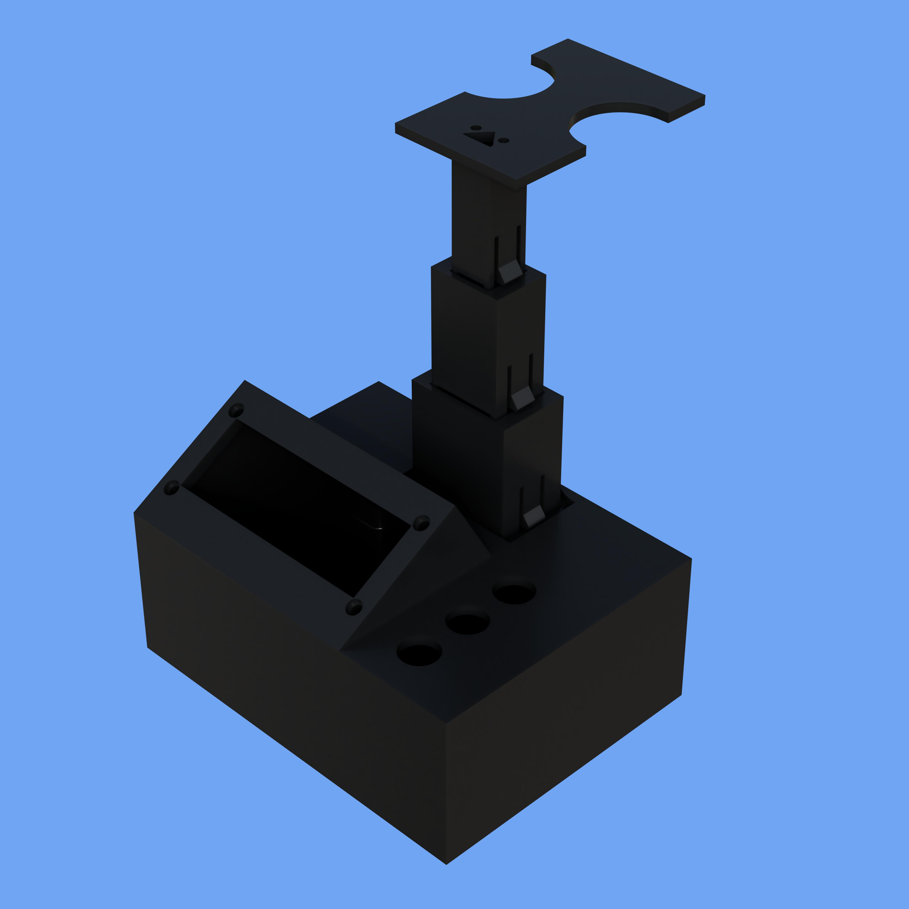
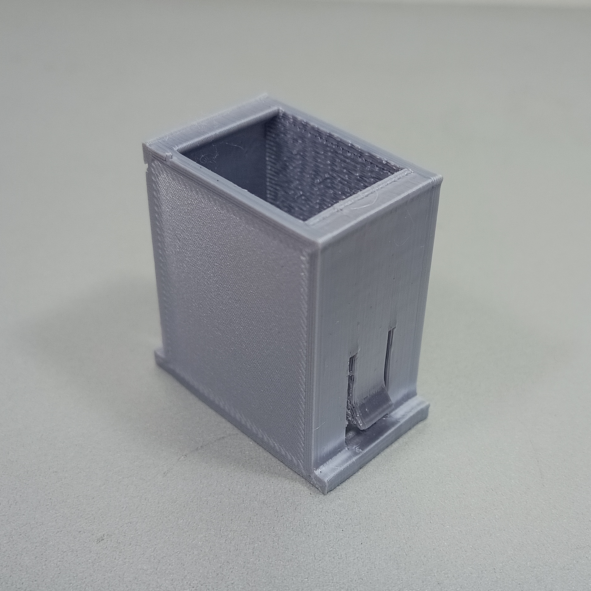
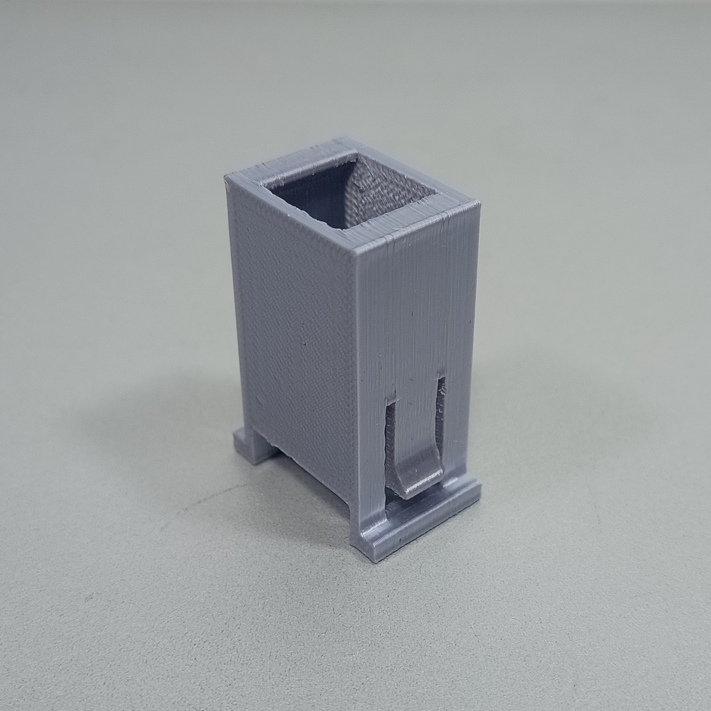
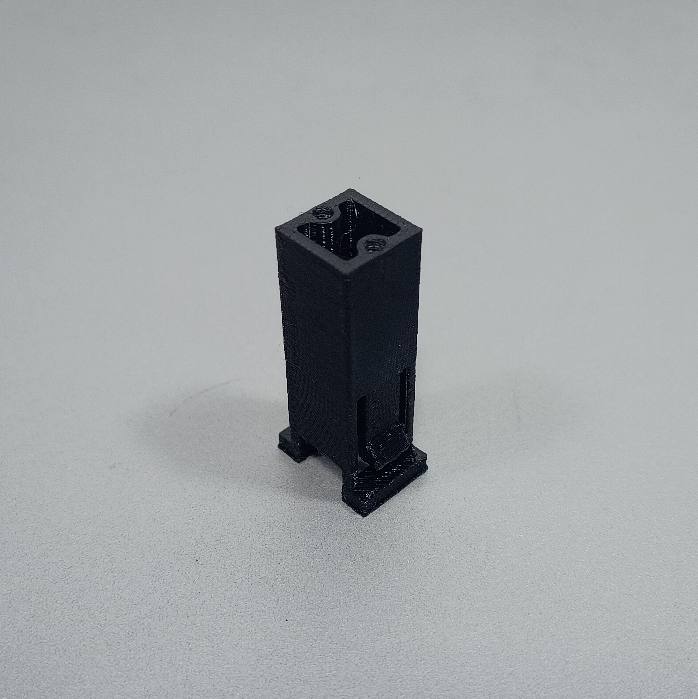
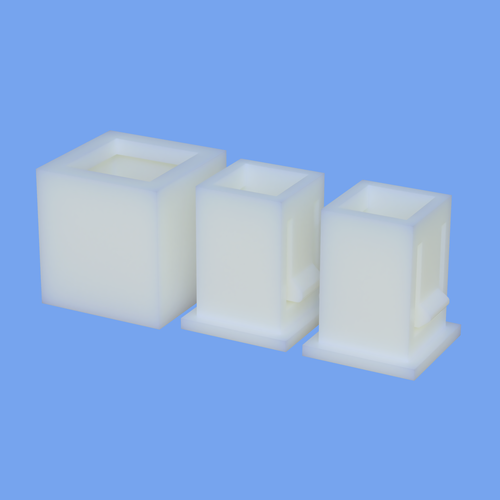
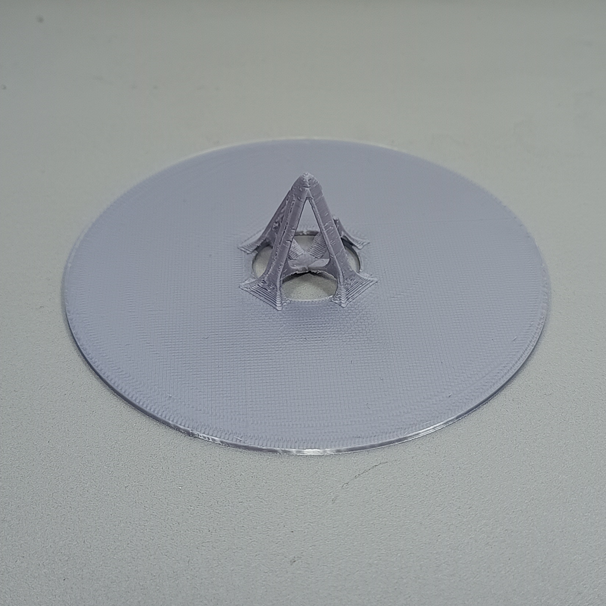

# Structure

A estrutura mecânica do Spring-Mass Collector reúne os componentes não eletrônicos responsáveis por proteger o sistema, posicionar o sensor, sustentar o experimento e garantir que o movimento da massa possa ser medido de maneira estável.

Esta página apresenta uma visão geral dessas partes. As justificativas de projeto, as orientações de impressão e a sequência de montagem são discutidas nas páginas [3D Printed Parts](3d-printed-parts.md) e [Assembly](assembly.md).

---

## Visão geral da estrutura

A parte mecânica do projeto pode ser dividida em dois grupos:

1. estrutura da caixa coletora;
2. sistema de posicionamento do sensor;

<figure markdown>
  

  <figcaption>
    Conjunto das peças impressas em 3D utilizadas na estrutura do Spring-Mass Collector.
  </figcaption>
</figure>

As peças principais são:

| Componente            | Função geral                                                  |
| --------------------- | ------------------------------------------------------------- |
| Caixa                 | protege e organiza os componentes eletrônicos                 |
| Suporte base          | conecta a caixa ao sistema extensível                         |
| Suporte intermediário | permite aumentar a altura do sensor                           |
| Suporte superior      | finaliza e estabiliza a estrutura extensível                  |
| Suporte do sensor     | posiciona o sensor infravermelho em relação ao disco refletor |

---

## Caixa principal

A caixa constitui o corpo principal do Spring-Mass Collector.

Ela abriga:

* microcontrolador;
* display LCD;
* botões;
* conexões elétricas;
* cabos;
* elementos de fixação;
* base do sistema extensível.

<figure markdown>
  

  <figcaption>
    Caixa principal utilizada para acomodar e proteger os componentes do sistema.
  </figcaption>
</figure>

A região frontal superior possui uma inclinação aproximada de 30°, utilizada para melhorar a visualização do display durante a operação.

A caixa também serve como base estrutural para o posicionamento vertical do sensor.

!!! info "Função da caixa"
Além de proteger os componentes eletrônicos, a caixa mantém o display, os botões e o sensor em posições definidas, reduzindo movimentações durante a coleta dos dados.

---

## Sistema extensível

O sensor deve permanecer alinhado com o disco refletor conectado à massa. Como diferentes molas e massas podem produzir posições de equilíbrio distintas, a estrutura possui um sistema extensível.

Esse sistema é formado por:

* suporte base;
* suporte intermediário;
* suporte superior;
* suporte do sensor.

O conjunto permite utilizar até três níveis de altura, adequando a posição do sensor à configuração do experimento.

---

## Suporte base

O suporte base é a primeira peça do sistema extensível.

Sua função é conectar a caixa principal aos demais suportes e fornecer uma referência estável para o movimento vertical da estrutura.

<figure markdown>
  

  <figcaption>
    Suporte base utilizado na conexão entre a caixa e o sistema extensível.
  </figcaption>
</figure>

Essa peça deve permanecer firmemente conectada à caixa, pois qualquer inclinação pode alterar o alinhamento entre o sensor e o disco refletor.

---

## Suporte intermediário

O suporte intermediário permite aumentar a altura do sistema.

Ele é utilizado quando a posição da massa fica acima do alcance obtido apenas com o suporte base.

<figure markdown>
  

  <figcaption>
    Suporte intermediário utilizado para ampliar a altura disponível.
  </figcaption>
</figure>

Dependendo da configuração experimental, podem ser utilizados diferentes níveis de extensão.

O suporte intermediário deve deslizar de forma controlada, sem folgas excessivas e sem exigir força elevada durante o ajuste.

---

## Suporte superior

O suporte superior finaliza a estrutura extensível e auxilia na estabilização do conjunto.

Ele também estabelece a conexão com o suporte responsável pelo posicionamento do sensor.

<figure markdown>
  

  <figcaption>
    Suporte superior utilizado na parte final da estrutura extensível.
  </figcaption>
</figure>

Quando montado corretamente, o suporte superior deve permanecer alinhado com as demais peças.

---

## Mecanismo de travamento

A estrutura extensível possui um mecanismo de travamento que impede mudanças involuntárias de altura durante o experimento.

O destravamento é realizado pressionando simultaneamente os dois lados do mecanismo.

<figure markdown>
  

  <figcaption>
    Região de travamento utilizada para ajustar e fixar a altura do sensor.
  </figcaption>
</figure>

Após o ajuste, o mecanismo deve retornar à posição de travamento.

!!! warning "Ajuste da altura"
A altura não deve ser alterada durante a coleta. Uma mudança na posição do sensor modifica a distância de referência e invalida a calibração realizada anteriormente.

---

## Suporte do sensor

O suporte do sensor mantém o sensor infravermelho orientado em direção ao disco refletor.

<figure markdown>
  

  <figcaption>
    Suporte responsável pelo posicionamento do sensor de distância.
  </figcaption>
</figure>

Sua função é manter:

* a orientação do sensor;
* a altura de medição;
* o alinhamento com o disco;
* a estabilidade durante a oscilação.

O sensor deve apontar aproximadamente para o centro do disco refletor ao longo de toda a região de movimento.

!!! note "Alinhamento"
Um pequeno desalinhamento pode causar variações na reflexão infravermelha, perda momentânea do alvo ou leituras fora da curva de calibração.

---

## Disco refletor

O disco refletor é conectado ao conjunto móvel do experimento.

Sua superfície fornece uma região de reflexão maior e mais regular do que a própria massa, facilitando a leitura do sensor infravermelho.

<figure markdown>
  

  <figcaption>
    Disco refletor posicionado no conjunto móvel do sistema massa-mola.
  </figcaption>
</figure>

Durante o movimento, o disco deve permanecer:

* aproximadamente perpendicular ao eixo de medição;
* centralizado em relação ao sensor;
* firmemente conectado ao suporte da massa;
* sem oscilações laterais excessivas.

A rotação ou inclinação do disco pode modificar a quantidade de radiação refletida e aumentar o ruído das medições.

---

## Relação entre os componentes

Durante o experimento, os componentes mecânicos cumprem funções complementares:

| Grupo                | Componentes                             | Função                                       |
| -------------------- | --------------------------------------- | -------------------------------------------- |
| Proteção e interface | caixa                                   | protege e organiza o sistema                 |
| Ajuste de altura     | suportes base, intermediário e superior | posiciona o sensor verticalmente             |
| Medição              | suporte do sensor e disco refletor      | mantém a geometria necessária para a leitura |

A qualidade da coleta depende da integração correta entre esses grupos.

Uma estrutura inadequadamente montada pode produzir:

* desalinhamento;
* oscilações laterais;
* vibração da caixa;
* perda do disco refletor;
* alteração da posição de referência;
* dados com ruído elevado.

---

## Requisitos mecânicos

Para o funcionamento adequado, a estrutura deve atender aos seguintes requisitos:

* permanecer estável durante a coleta;
* manter o sensor alinhado com o disco refletor;
* permitir o ajuste da altura;
* impedir mudanças involuntárias da extensão;
* proteger os componentes eletrônicos;
* permitir acesso aos botões e ao display;
* evitar contato entre partes móveis e a caixa;
* manter a massa dentro da faixa útil do sensor;
* possibilitar desmontagem para manutenção.

Antes de iniciar uma coleta, deve-se confirmar que todas as peças estão firmemente encaixadas e que o movimento da massa ocorre sem colisões ou restrições.

---

## Cuidados durante o uso

Durante a utilização da estrutura:

* não force o sistema extensível;
* pressione os dois lados da trava antes de ajustar a altura;
* não mova a caixa durante a coleta;
* não permita que a massa colida com o sensor;
* não utilize molas deformadas;
* verifique a fixação do disco refletor;
* mantenha o sensor orientado para o centro do disco;
* realize uma nova calibração após qualquer alteração mecânica.

!!! danger "Movimento da massa"
Antes de liberar a massa, verifique se sua trajetória está livre. O suporte, o disco refletor e as massas não devem colidir com a caixa, o sensor ou a estrutura do experimento.

---

## Próximas etapas

A página [3D Printed Parts](3d-printed-parts.md) apresenta as justificativas de projeto de cada peça e as orientações utilizadas durante a impressão.

A página [Assembly](assembly.md) descreve a sequência recomendada para montar os componentes e os cuidados necessários durante o encaixe das peças.
