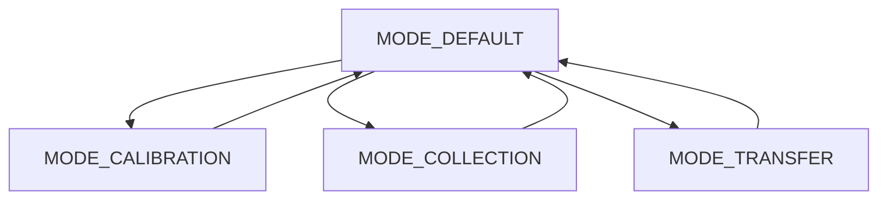

# Firmware Architecture

A arquitetura do firmware do **Spring-Mass Collector** foi organizada para separar aquisição de dados, interface local, controle dos modos de operação, armazenamento e transferência Bluetooth.

Essa separação torna o sistema mais estável, facilita a manutenção do código e reduz o risco de que tarefas lentas, como atualização do LCD ou envio Bluetooth, prejudiquem a regularidade da coleta de dados.

---

## Visão geral da arquitetura

O firmware pode ser entendido como um conjunto de módulos que trabalham em conjunto:

```text
Firmware
├── Sensor
├── Storage
├── Display
├── Buttons
├── Modes
├── BluetoothComm
├── Tasks
└── Globals
```

Cada módulo possui uma responsabilidade específica dentro do sistema.

| Módulo          | Responsabilidade principal                             |
| --------------- | ------------------------------------------------------ |
| `Sensor`        | leitura, filtragem e conversão do sensor infravermelho |
| `Storage`       | armazenamento dos pontos de tempo e posição            |
| `Display`       | controle das telas exibidas no LCD                     |
| `Buttons`       | leitura dos botões físicos com debounce                |
| `Modes`         | controle da máquina de estados                         |
| `BluetoothComm` | envio dos dados por Bluetooth e Serial                 |
| `Tasks`         | criação e execução das tarefas do sistema              |
| `Globals`       | constantes, variáveis globais, estados e mutexes       |

---

## Objetivo da separação em módulos

A separação em módulos evita que todo o firmware fique concentrado em um único arquivo `.ino`.

Essa organização melhora:

* leitura do código;
* manutenção;
* depuração;
* documentação;
* reaproveitamento de funções;
* expansão futura do sistema.

Por exemplo, alterações na curva do sensor ficam concentradas no módulo `Sensor`, enquanto mudanças no formato de envio dos dados ficam no módulo `BluetoothComm` ou `Storage`.

---

## Fluxo geral do firmware

O funcionamento geral do firmware pode ser resumido assim:

```text
Inicialização do sistema
        ↓
Configuração dos módulos
        ↓
Criação das tarefas
        ↓
Entrada no modo Default
        ↓
Leitura contínua dos botões
        ↓
Execução da máquina de estados
        ↓
Coleta, calibração ou transferência conforme o modo atual
```

Durante esse processo, o sistema mantém variáveis internas que indicam:

* modo atual;
* estado da coleta;
* posição inicial calibrada;
* posição relativa atual;
* quantidade de dados armazenados;
* solicitação de transferência;
* estado da comunicação Bluetooth.

---

## Máquina de estados

O comportamento principal do sistema é controlado por uma máquina de estados.

No firmware, os modos principais são:

```cpp
enum SystemMode {
  MODE_DEFAULT,
  MODE_CALIBRATION,
  MODE_COLLECTION,
  MODE_TRANSFER
};
```

Cada modo define:

* o que aparece no LCD;
* como os botões são interpretados;
* quais variáveis podem ser alteradas;
* quais ações devem ser executadas.



---

## Modo Default

O modo `MODE_DEFAULT` é o estado inicial do sistema depois da inicialização.

Ele funciona como o menu principal da caixa:

```text
1-Cal 2-Col
3-Transf
```

Nesse modo:

| Botão | Ação                           |
| ----- | ------------------------------ |
| B1    | entra no modo de calibração    |
| B2    | entra no modo de coleta        |
| B3    | entra no modo de transferência |

Ao entrar no modo Default, o sistema garante que nenhuma coleta ou transferência esteja ativa:

```cpp
collectionActive = false;
collectionPaused = false;
transferRequested = false;
transferInProgress = false;
```

---

## Modo de Calibração

O modo `MODE_CALIBRATION` define a posição inicial da massa.

Nesse modo, o sistema lê a distância atual medida pelo sensor e registra esse valor como posição inicial:

```cpp
initialPositionCm = data.distance_cm;
```

Depois disso, a posição relativa durante a coleta será calculada por:

$$
x_{rel}(t) = x(t) - x_0
$$

onde (x_0) é a posição inicial definida na calibração.

---

## Modo de Coleta

O modo `MODE_COLLECTION` é responsável pela aquisição dos dados experimentais.

Ao iniciar a coleta, o sistema limpa o buffer e define um novo tempo inicial:

```cpp
resetDataBuffer();
collectionActive = true;
collectionPaused = false;
collectionStartMs = millis();
```

Durante a coleta, cada ponto armazenado possui:

```cpp
struct DataPoint {
  uint32_t time_ms;
  float position_cm;
};
```

A posição armazenada corresponde à posição relativa da massa em centímetros.

---

## Modo de Transferência

O modo `MODE_TRANSFER` permite enviar os dados armazenados para um dispositivo externo.

Nesse modo, o sistema exibe a quantidade de dados disponíveis e o limite máximo configurado:

```text
Modo Transfer
D: 120 M:5000
```

As funções principais são:

| Botão | Ação                                |
| ----- | ----------------------------------- |
| B1    | enviar dados por Bluetooth e Serial |
| B2    | voltar ao modo Default              |
| B3    | alterar limite máximo de dados      |

---

## Uso de tarefas na ESP32

A ESP32 permite organizar partes do firmware em tarefas independentes. Essa arquitetura é útil porque algumas operações precisam ser executadas com maior regularidade, enquanto outras podem ser mais lentas.

A coleta do sensor deve ser regular. Já o LCD e o Bluetooth podem ter tempos de resposta maiores.

Por isso, o firmware separa as funções principais em tarefas:

```text
TaskSensor
TaskButtons
TaskModes
TaskDisplay
TaskBluetooth
```

---

## Distribuição entre os núcleos da ESP32

A arquitetura proposta separa a aquisição do sensor das tarefas de interface e comunicação.

```text
Core 1
└── TaskSensor
    ├── lê o sensor infravermelho
    ├── converte tensão em distância
    ├── calcula posição relativa
    └── armazena os dados

Core 0
├── TaskButtons
│   └── lê os botões com debounce
│
├── TaskModes
│   └── controla a máquina de estados
│
├── TaskDisplay
│   └── atualiza o LCD
│
└── TaskBluetooth
    └── envia os dados por Bluetooth e Serial
```

Essa separação evita que operações lentas de interface interfiram diretamente na regularidade da aquisição dos dados.

---

## TaskSensor

A `TaskSensor` é responsável pela aquisição dos dados.

Ela executa as seguintes etapas:

```text
Verifica se o sistema está no modo de coleta
        ↓
Verifica se a coleta está ativa
        ↓
Verifica se a coleta não está pausada
        ↓
Verifica se o buffer ainda possui espaço
        ↓
Lê o sensor
        ↓
Converte a leitura em distância
        ↓
Calcula a posição relativa
        ↓
Armazena tempo e posição
        ↓
Aguarda o próximo período de amostragem
```

A tarefa deve manter uma periodicidade regular. Para isso, pode ser usada uma função como:

```cpp
vTaskDelayUntil();
```

Essa função é mais adequada do que um `delay()` simples quando se deseja manter uma taxa de execução mais estável.

---

## Período de amostragem

O intervalo de coleta é definido por uma constante do firmware, por exemplo:

```cpp
SAMPLE_INTERVAL_MS = 25;
```

Nesse caso, a frequência de amostragem é:

$$
f = \frac{1}{0.025}
$$

$$
f = 40 \ \text{Hz}
$$

Isso significa que o sistema registra aproximadamente 40 pontos por segundo.

---

## TaskButtons

A `TaskButtons` é responsável pela leitura dos botões físicos.

Ela aplica debounce para evitar que um único pressionamento seja interpretado como múltiplos cliques.

O fluxo geral é:

```text
Ler estado físico dos botões
        ↓
Aplicar debounce
        ↓
Identificar clique válido
        ↓
Gerar evento de botão
```

Os botões não alteram diretamente o estado do sistema. Eles apenas geram eventos. A interpretação desses eventos é feita pela máquina de estados.

---

## TaskModes

A `TaskModes` executa a lógica da máquina de estados.

Ela verifica o modo atual e chama a função correspondente:

```cpp
handleDefaultMode();
handleCalibrationMode();
handleCollectionMode();
handleTransferMode();
```

Esse módulo interpreta os eventos dos botões de acordo com o modo ativo.

Por exemplo:

| Modo          | B1                  |
| ------------- | ------------------- |
| Default       | entra em calibração |
| Calibração    | recalibra           |
| Coleta        | pausa ou retoma     |
| Transferência | envia os dados      |

Essa separação permite que o mesmo botão tenha funções diferentes sem tornar o código confuso.

---

## TaskDisplay

A `TaskDisplay` controla a atualização do LCD 16x2 I2C.

O LCD é mais lento do que a aquisição do sensor. Por isso, a tela não deve ser atualizada a cada amostra coletada.

A ideia é separar:

```text
Coleta de dados → rápida e regular
Atualização LCD → mais lenta e resumida
```

Durante a coleta, o LCD pode mostrar apenas parte das informações:

```text
x:   0.25 cm
N:    120 RUN
```

Enquanto isso, todos os dados continuam sendo armazenados no buffer.

!!! note "LCD e aquisição"
A taxa de atualização do LCD não representa a taxa real de coleta. O LCD serve apenas como interface de acompanhamento.

---

## TaskBluetooth

A `TaskBluetooth` é responsável pelo envio dos dados armazenados.

Ela observa uma variável de controle, como:

```cpp
transferRequested
```

Quando o usuário solicita a transferência, essa flag é ativada. A tarefa então executa:

```text
Marca transferência em andamento
        ↓
Atualiza LCD
        ↓
Envia cabeçalho
        ↓
Envia os pares tempo, posição
        ↓
Envia END
        ↓
Finaliza transferência
```

Durante o envio, o LCD pode mostrar:

```text
Transferindo
Aguarde...
```

Ao final, o sistema retorna para a tela do modo de transferência.

---

## Armazenamento dos dados

O armazenamento é feito em memória RAM, em um vetor global de pontos experimentais.

Conceitualmente:

```cpp
DataPoint dataBuffer[DATA_BUFFER_CAPACITY];
```

Cada ponto contém:

| Campo         | Tipo       | Função                         |
| ------------- | ---------- | ------------------------------ |
| `time_ms`     | `uint32_t` | tempo desde o início da coleta |
| `position_cm` | `float`    | posição relativa da massa      |

Se cada ponto ocupar aproximadamente 8 bytes, um buffer com 5000 pontos ocupa cerca de:

$$
5000 \times 8 = 40000 \ \text{bytes}
$$

ou aproximadamente:

$$
40 \ \text{kB}
$$

Esse valor é adequado para a memória disponível na ESP32.

---

## Controle de memória cheia

O firmware controla o número máximo de pontos armazenados.

Quando o buffer atinge o limite configurado, a coleta é interrompida:

```cpp
collectionPaused = true;
collectionActive = false;
```

O LCD mostra:

```text
MEMORIA CHEIA
```

Esse comportamento evita escrita fora da região reservada do buffer.

O usuário pode então transferir os dados ou resetar a coleta.

---

## Proteção com mutex

Como várias tarefas podem acessar as mesmas variáveis, o firmware utiliza mutexes para proteger recursos compartilhados.

Os principais grupos protegidos são:

```text
dataMutex
stateMutex
lcdMutex
```

---

## dataMutex

O `dataMutex` protege o buffer de dados e variáveis associadas:

```text
dataBuffer
dataCount
dataBufferFull
maxDataPoints
```

Ele evita que uma tarefa tente ler os dados enquanto outra está escrevendo.

---

## stateMutex

O `stateMutex` protege variáveis de estado do sistema:

```text
currentMode
collectionActive
collectionPaused
calibrated
initialPositionCm
latestDistanceCm
latestRelativePositionCm
transferRequested
transferInProgress
```

Isso evita inconsistências quando diferentes tarefas acessam ou modificam o estado do sistema.

---

## lcdMutex

O `lcdMutex` protege o acesso ao LCD.

O display não deve ser atualizado por duas tarefas ao mesmo tempo. O uso do mutex evita conflitos no barramento I2C e problemas de escrita na tela.

---

## Por que não usar apenas o loop

Em um programa Arduino simples, todas as funções poderiam ser colocadas dentro do `loop()`:

```text
Ler botões
Ler sensor
Atualizar LCD
Enviar Bluetooth
Armazenar dados
```

O problema é que essas operações possuem tempos diferentes.

A leitura do sensor precisa ser regular. O LCD é relativamente lento. O envio Bluetooth pode levar mais tempo dependendo da quantidade de dados. Os botões precisam ser lidos com frequência para manter boa resposta ao usuário.

Se tudo for executado em sequência, uma operação lenta pode atrasar a aquisição dos dados.

Com tarefas separadas, o sistema fica mais robusto:

```text
Sensor não espera o LCD
LCD não trava a coleta
Bluetooth não interfere diretamente na aquisição
Botões continuam responsivos
```

---

## Resumo da arquitetura

A arquitetura do firmware separa o sistema em módulos e tarefas independentes.

```text
Firmware Architecture
├── Sensor acquisition
│   └── TaskSensor
│
├── User interface
│   ├── TaskButtons
│   └── TaskDisplay
│
├── State control
│   └── TaskModes
│
├── Data transfer
│   └── TaskBluetooth
│
├── Data storage
│   └── Storage module
│
└── Shared state protection
    ├── dataMutex
    ├── stateMutex
    └── lcdMutex
```

Essa organização permite que o Spring-Mass Collector funcione como um sistema embarcado de aquisição de dados, com coleta regular, interface local simples e transferência Bluetooth independente.
