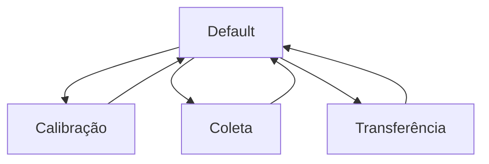

# Operation Modes

O firmware do **Spring-Mass Collector** é organizado em modos de operação. Cada modo define o comportamento do sistema, as informações exibidas no LCD e a função de cada botão.

Essa organização permite que a caixa funcione como uma máquina de estados, tornando o uso mais simples para o usuário e o código mais organizado para manutenção e futuras expansões.

---

## Visão geral dos modos

O sistema possui quatro modos principais:

| Modo          | Função principal                                  |
| ------------- | ------------------------------------------------- |
| Default       | apresenta o menu principal                        |
| Calibração    | define a posição inicial de referência            |
| Coleta        | mede e armazena os dados de posição               |
| Transferência | envia os dados armazenados por Bluetooth e Serial |

A navegação entre esses modos é feita por três botões físicos.



---

## Máquina de estados

No firmware, os modos podem ser representados por uma enumeração:

```cpp
enum SystemMode {
  MODE_DEFAULT,
  MODE_CALIBRATION,
  MODE_COLLECTION,
  MODE_TRANSFER
};
```

Cada valor representa um estado lógico do sistema. O modo atual determina como o sistema interpreta os botões e quais tarefas devem ser executadas.

!!! note "Máquina de estados"
Uma máquina de estados permite organizar o comportamento do sistema em blocos independentes. Assim, o mesmo botão pode executar funções diferentes dependendo do modo atual.

---

## Modo Default

O modo **Default** é o estado inicial da caixa após a inicialização. Ele funciona como o menu principal do sistema.

Nesse modo, a caixa não coleta dados e não realiza transferência. Ela apenas aguarda a escolha do usuário.

Uma tela típica no LCD é:

```text
1-Cal 2-Col
3-Transf
```

As funções dos botões no modo Default são:

| Botão | Função                          |
| ----- | ------------------------------- |
| B1    | entrar no modo de calibração    |
| B2    | entrar no modo de coleta        |
| B3    | entrar no modo de transferência |

Ao retornar para o modo Default, o sistema garante que nenhuma coleta ou transferência esteja ativa.

Conceitualmente, o sistema retorna para um estado seguro:

```cpp
collectionActive = false;
collectionPaused = false;
transferRequested = false;
transferInProgress = false;
```

Esse comportamento evita que uma tarefa anterior continue rodando após a troca de modo.

---

## Modo de Calibração

O modo de **Calibração** define a posição inicial da massa. Essa posição será usada como referência para calcular o deslocamento relativo durante a coleta.

Quando o usuário entra nesse modo, o sistema lê a distância atual medida pelo sensor e registra esse valor como posição inicial:

```cpp
initialPositionCm = data.distance_cm;
```

A partir dessa referência, a posição relativa passa a ser calculada por:

$$
x_{rel}(t) = x(t) - x_0
$$

onde (x(t)) é a distância medida em cada instante e (x_0) é a posição inicial definida na calibração.

Uma tela típica no LCD é:

```text
Pos Inicial:
  10.25 cm
```

As funções dos botões no modo de Calibração são:

| Botão | Função                                             |
| ----- | -------------------------------------------------- |
| B1    | recalibrar a posição inicial                       |
| B2    | confirmar e voltar ao modo Default                 |
| B3    | zerar a posição inicial e permanecer na calibração |

!!! warning "Cuidados na calibração"
A calibração deve ser feita com a massa parada na posição de referência. Caso a massa esteja em movimento, o zero experimental pode ser definido incorretamente.

---

## Modo de Coleta

O modo de **Coleta** é o estado principal do experimento. Nele, o sistema mede a posição da massa ao longo do tempo e armazena os dados em memória.

Ao entrar nesse modo, o sistema inicia uma nova aquisição:

```cpp
resetDataBuffer();
collectionActive = true;
collectionPaused = false;
collectionStartMs = millis();
```

Durante a coleta, cada ponto armazenado contém:

| Campo         | Descrição                                |
| ------------- | ---------------------------------------- |
| `time_ms`     | tempo desde o início da coleta           |
| `position_cm` | posição relativa da massa em centímetros |

Conceitualmente, cada ponto experimental pode ser representado por:

```cpp
struct DataPoint {
  uint32_t time_ms;
  float position_cm;
};
```

Uma tela típica durante a coleta é:

```text
x:   0.25 cm
N:    120 RUN
```

onde:

| Campo | Significado                  |
| ----- | ---------------------------- |
| `x`   | posição relativa atual       |
| `N`   | número de pontos armazenados |
| `RUN` | coleta em andamento          |

As funções dos botões no modo de Coleta são:

| Botão | Função                                |
| ----- | ------------------------------------- |
| B1    | pausar ou retomar a coleta            |
| B2    | resetar os dados e reiniciar a coleta |
| B3    | voltar ao modo Default                |

---

## Pausa e retomada da coleta

Durante a coleta, o usuário pode pausar temporariamente o armazenamento dos dados.

Quando a coleta está pausada, o sistema mantém os dados já armazenados, mas deixa de registrar novos pontos até que a coleta seja retomada.

A lógica pode ser resumida como:

```text
Coleta ativa
        ↓
B1 pressionado
        ↓
Coleta pausada
        ↓
B1 pressionado novamente
        ↓
Coleta retomada
```

Esse recurso é útil quando o usuário precisa interromper temporariamente o experimento sem apagar os dados já coletados.

---

## Reset da coleta

No modo de Coleta, o botão **B2** reinicia a aquisição.

Ao resetar, o sistema apaga os dados armazenados anteriormente e inicia uma nova coleta:

```cpp
resetDataBuffer();
collectionActive = true;
collectionPaused = false;
collectionStartMs = millis();
```

!!! warning "Reset dos dados"
O reset da coleta apaga os dados armazenados no buffer. Caso os dados sejam importantes, transfira-os antes de reiniciar a aquisição.

---

## Memória cheia

O sistema possui um limite máximo de pontos que podem ser armazenados.

Quando esse limite é atingido, a coleta é interrompida automaticamente e o LCD mostra uma mensagem de aviso:

```text
MEMORIA CHEIA
```

Nesse estado, o sistema impede que novos dados sejam adicionados ao buffer:

```cpp
collectionPaused = true;
collectionActive = false;
```

Isso evita que a tarefa de aquisição continue tentando gravar dados em uma região de memória já preenchida.

!!! note "Tela de memória cheia"
A tela de memória cheia deve ser exibida de forma estável. Atualizações repetidas do LCD podem causar flickering e prejudicar a leitura da mensagem.

---

## Modo de Transferência

O modo de **Transferência** permite enviar os dados armazenados para um dispositivo externo.

Nesse modo, a caixa não realiza nova coleta. Ela apenas informa a quantidade de dados disponíveis e aguarda o comando de envio.

Uma tela típica é:

```text
Modo Transfer
D: 120 M:5000
```

onde:

| Campo | Significado                        |
| ----- | ---------------------------------- |
| `D`   | quantidade de dados armazenados    |
| `M`   | limite máximo de dados configurado |

As funções dos botões no modo de Transferência são:

| Botão | Função                               |
| ----- | ------------------------------------ |
| B1    | enviar dados por Bluetooth e Serial  |
| B2    | voltar ao modo Default               |
| B3    | alterar a quantidade máxima de dados |

---

## Alteração do limite máximo de dados

No modo de Transferência, o botão **B3** permite alterar a quantidade máxima de pontos que serão coletados em uma aquisição.

Um ciclo possível de configuração é:

```text
500 → 1000 → 2000 → 3000 → 5000 → 500
```

Essa configuração altera o limite usado durante a coleta, mas não altera a capacidade física do buffer definida no firmware.

Por exemplo, se a capacidade máxima do vetor for:

```cpp
DATA_BUFFER_CAPACITY = 5000;
```

o usuário pode escolher limites menores para realizar testes mais rápidos.

!!! note "Limite lógico e capacidade física"
A capacidade física representa o tamanho máximo do vetor reservado em memória. O limite configurável representa quantos pontos o usuário deseja coletar em uma aquisição específica.

---

## Envio dos dados

Quando o usuário pressiona **B1** no modo de Transferência, o sistema envia os dados armazenados.

A transmissão é feita em formato textual:

```text
t_ms,pos_cm
25,0.0123
50,0.0181
75,0.0204
100,0.0195
END
```

A primeira linha contém o cabeçalho. As linhas seguintes contêm os pares de tempo e posição. A palavra `END` indica o fim da transmissão.

Durante o envio, o LCD pode mostrar:

```text
Transferindo
Aguarde...
```

Ao final da transmissão, o sistema retorna para a tela do modo de Transferência.

---

## Função dos botões por modo

A tabela abaixo resume a função de cada botão em cada modo:

| Modo          | B1             | B2                | B3                      |
| ------------- | -------------- | ----------------- | ----------------------- |
| Default       | Calibração     | Coleta            | Transferência           |
| Calibração    | Recalibrar     | Confirmar         | Zerar posição inicial   |
| Coleta        | Pausar/retomar | Resetar coleta    | Voltar ao Default       |
| Transferência | Enviar dados   | Voltar ao Default | Alterar limite de dados |

Essa organização permite controlar todo o sistema com apenas três botões físicos.

---

## Resumo

Os modos de operação organizam o comportamento do Spring-Mass Collector em etapas claras:

```text
Default
  ├── Calibração
  ├── Coleta
  └── Transferência
```

Essa estrutura simplifica o uso do equipamento, reduz ambiguidades na interface e facilita a manutenção do firmware.
