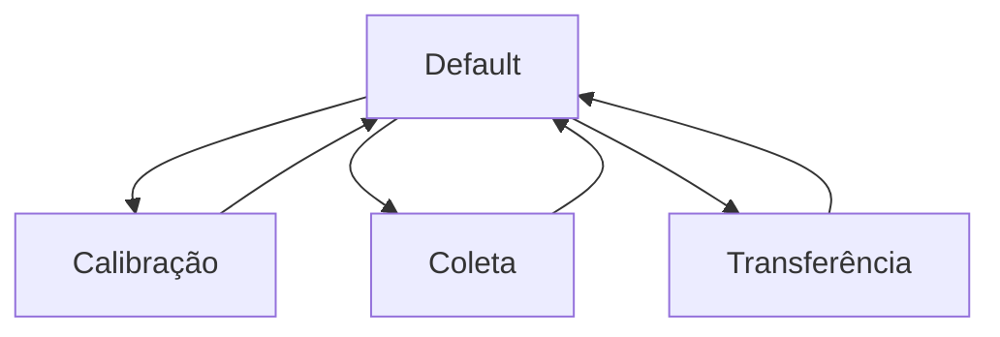

# Software Overview

O software do **Spring-Mass Collector** é responsável por controlar a leitura do sensor, os modos de operação, o armazenamento dos dados, a interface com o usuário e a transferência por Bluetooth.

O firmware foi desenvolvido para a **ESP32** usando a **Arduino IDE**, com organização modular em múltiplos arquivos. Essa escolha torna o projeto mais acessível, facilita a manutenção do código e permite que o sistema seja reproduzido por estudantes, professores e desenvolvedores.

---

## Função do software no sistema

O software transforma o conjunto eletrônico em um sistema de aquisição de dados.

De forma geral, ele executa as seguintes funções:

```text
Ler o sensor infravermelho
        ↓
Converter a leitura em distância
        ↓
Calcular a posição relativa
        ↓
Armazenar tempo e posição
        ↓
Atualizar o LCD
        ↓
Interpretar os botões
        ↓
Controlar os modos de operação
        ↓
Transferir os dados por Bluetooth
```

Assim, o firmware conecta o hardware físico ao uso experimental do equipamento.

---

## Arquitetura geral

O firmware é organizado em módulos. Cada módulo concentra uma responsabilidade específica do sistema.

```text
Firmware
├── Inicialização do sistema
├── Variáveis globais e estados
├── Leitura do sensor
├── Armazenamento dos dados
├── Controle do LCD
├── Leitura dos botões
├── Máquina de estados
├── Comunicação Bluetooth
└── Tarefas FreeRTOS
```

Essa organização evita que todo o código fique concentrado em um único arquivo principal, facilitando depuração, documentação e expansão futura.

---

## Módulos principais do firmware

A estrutura modular do firmware pode ser organizada da seguinte forma:

| Módulo               | Função                                                 |
| -------------------- | ------------------------------------------------------ |
| `MassaMolaESP32.ino` | inicialização geral do sistema                         |
| `Globals`            | constantes, variáveis globais, estados e mutexes       |
| `Sensor`             | leitura, filtragem e conversão do sensor infravermelho |
| `Storage`            | armazenamento e exportação dos dados                   |
| `Display`            | controle das telas do LCD                              |
| `Buttons`            | leitura dos botões com debounce                        |
| `Modes`              | máquina de estados e lógica dos modos                  |
| `BluetoothComm`      | envio dos dados por Bluetooth e Serial                 |
| `Tasks`              | criação e execução das tarefas do sistema              |

Essa separação permite que cada parte do firmware seja compreendida e modificada de forma independente.

---

## Modos de operação

O comportamento do sistema é organizado em quatro modos principais:

| Modo               | Função                                 |
| ------------------ | -------------------------------------- |
| `MODE_DEFAULT`     | apresenta o menu principal             |
| `MODE_CALIBRATION` | define a posição inicial de referência |
| `MODE_COLLECTION`  | realiza a coleta dos dados             |
| `MODE_TRANSFER`    | envia os dados armazenados             |

No firmware, esses modos podem ser representados por:

```cpp
enum SystemMode {
  MODE_DEFAULT,
  MODE_CALIBRATION,
  MODE_COLLECTION,
  MODE_TRANSFER
};
```

Cada modo define:

* quais informações aparecem no LCD;
* como os botões são interpretados;
* quais tarefas estão ativas;
* quais variáveis de estado podem ser alteradas.

---

## Máquina de estados

A lógica principal do sistema é baseada em uma máquina de estados.



A máquina de estados permite que o mesmo botão tenha funções diferentes dependendo do modo atual.

Por exemplo:

| Botão | Default       | Calibração    | Coleta         | Transferência  |
| ----- | ------------- | ------------- | -------------- | -------------- |
| B1    | calibração    | recalibrar    | pausar/retomar | enviar dados   |
| B2    | coleta        | confirmar     | resetar coleta | voltar         |
| B3    | transferência | zerar posição | voltar         | alterar limite |

Essa estrutura torna o uso da caixa mais simples, pois apenas três botões controlam todo o sistema.

---

## Aquisição dos dados

Durante a coleta, o firmware lê o sensor infravermelho, converte a leitura para distância e calcula a posição relativa da massa.

A posição relativa é calculada por:

$$
x_{rel}(t) = x(t) - x_0
$$

onde (x(t)) é a distância medida pelo sensor em cada instante e (x_0) é a posição inicial definida na calibração.

Cada ponto armazenado possui dois campos principais:

```cpp
struct DataPoint {
  uint32_t time_ms;
  float position_cm;
};
```

O campo `time_ms` representa o tempo desde o início da coleta, enquanto `position_cm` representa a posição relativa da massa em centímetros.

---

## Armazenamento dos dados

Os dados são armazenados temporariamente na memória da ESP32.

O formato conceitual do buffer é:

```text
tempo, posição
tempo, posição
tempo, posição
...
```

Durante a transferência, os dados são enviados como CSV:

```text
t_ms,pos_cm
25,0.0123
50,0.0181
75,0.0204
END
```

A palavra `END` indica o final da transmissão.

O armazenamento em memória permite que a coleta seja realizada primeiro e a transferência seja feita depois, sem depender de uma conexão Bluetooth ativa durante todo o experimento.

---

## Interface com o usuário

O software controla a interface local formada pelo LCD 16x2 I2C e pelos três botões físicos.

O LCD exibe informações resumidas, como:

* menu principal;
* posição inicial;
* posição relativa;
* quantidade de dados armazenados;
* estado da coleta;
* modo de transferência;
* aviso de memória cheia.

Os botões geram eventos que são interpretados pela máquina de estados. Essa separação evita que a leitura física do botão fique misturada com a lógica de cada modo.

---

## Comunicação Bluetooth

O firmware utiliza Bluetooth Serial para enviar os dados armazenados para um dispositivo externo.

A comunicação é representada por:

```cpp
BluetoothSerial SerialBT;
```

O dispositivo pode aparecer no terminal Bluetooth como:

```text
MassaMolaEsp32
```

Durante a transferência, o firmware envia:

```text
cabeçalho
dados armazenados
marcador de fim
```

Esse processo permite salvar os dados em um arquivo `.csv` para análise externa.

---

## Uso de tarefas na ESP32

A ESP32 permite organizar partes do firmware em tarefas independentes. Essa abordagem ajuda a separar processos com tempos de execução diferentes.

A arquitetura proposta separa:

```text
Aquisição do sensor
Interface LCD
Leitura dos botões
Controle dos modos
Transferência Bluetooth
```

Essa separação é importante porque a aquisição do sensor precisa ser regular, enquanto o LCD e o Bluetooth podem ser mais lentos.

Se todas as funções fossem executadas sequencialmente em um único fluxo, uma operação lenta de LCD ou Bluetooth poderia prejudicar a regularidade da coleta.

---

## Separação entre coleta e exibição

Uma decisão importante do firmware é separar a taxa de coleta da taxa de atualização do LCD.

O sistema pode armazenar dados com intervalo curto, enquanto o LCD é atualizado com menor frequência.

```text
Coleta de dados → rápida e regular
Atualização LCD → mais lenta e resumida
```

Essa separação evita que a interface visual prejudique a qualidade dos dados armazenados.

!!! note "LCD e coleta"
O LCD não mostra todos os dados coletados. Ele apresenta apenas uma visualização resumida, enquanto o buffer mantém todos os pontos armazenados.

---

## Controle de memória cheia

O firmware também controla o limite máximo de dados armazenados.

Quando o número de pontos chega ao limite configurado, a coleta é interrompida automaticamente e o sistema exibe uma mensagem de memória cheia no LCD.

```text
Dados coletados atingem o limite
        ↓
Coleta é interrompida
        ↓
LCD mostra MEMORIA CHEIA
        ↓
Usuário pode transferir ou reiniciar a coleta
```

Esse comportamento evita tentativas de escrita fora do espaço reservado no buffer.

---

## Organização do fluxo principal

O fluxo geral do firmware pode ser resumido como:

```text
Inicialização
        ↓
Configuração dos módulos
        ↓
Entrada no modo Default
        ↓
Leitura contínua dos botões
        ↓
Execução da máquina de estados
        ↓
Coleta, calibração ou transferência conforme o modo
```

Cada modo ativa apenas as ações necessárias para aquele estado do sistema.

---

## Relação entre software e experimento

O software não realiza automaticamente a análise física do movimento. Sua função é produzir os dados necessários para essa análise.

O dado final fornecido pelo sistema é:

$$
x_{rel}(t)
$$

Essa série pode ser usada posteriormente para estudar modelos de oscilação amortecida, como:

$$
x(t) = A e^{-\gamma t}\cos(\omega_d t + \phi)
$$

A análise desses dados é feita externamente em ferramentas como Python, Excel, MATLAB, Mathematica, Origin ou softwares equivalentes.

---

## Resumo

O software do Spring-Mass Collector integra todos os módulos do sistema:

```text
Software
├── Lê o sensor
├── Calcula a posição relativa
├── Controla o LCD
├── Interpreta os botões
├── Gerencia os modos de operação
├── Armazena os dados
├── Controla o limite de memória
└── Transfere os dados por Bluetooth
```

Essa organização transforma a ESP32 em uma unidade embarcada de aquisição de dados, permitindo que o experimento massa-mola seja registrado de forma automática, portátil e reprodutível.
