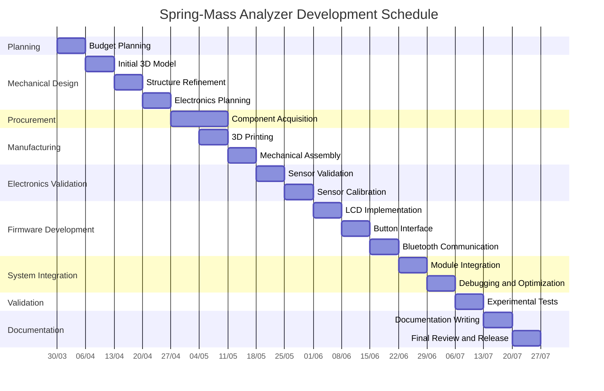

# Timeline

## Development Schedule

The development schedule was organized to cover all stages of the project, from the initial planning phase to the final release of the open-source documentation.

