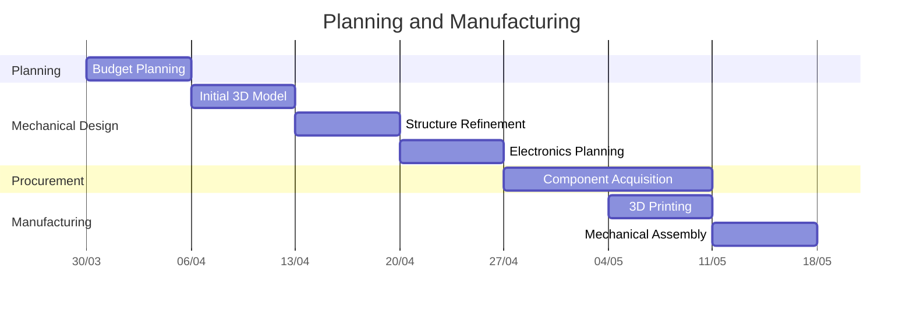
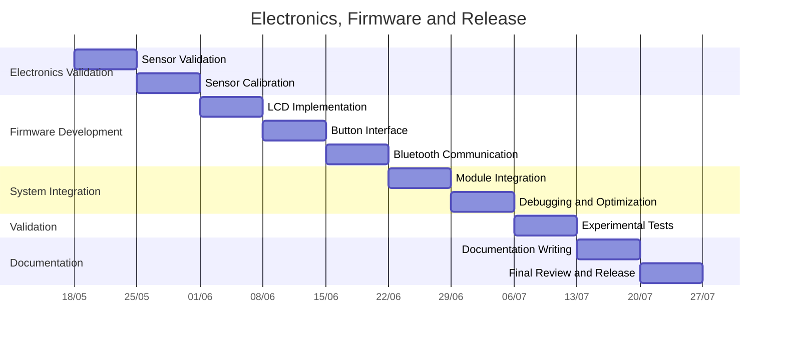

# Timeline

## Development Schedule

The development schedule was organized to cover all stages of the project, from the initial planning phase to the final release of the open-source documentation.

---

## Planning, Design and Manufacturing

### Activities

| Week | Period | Activity |
|--------|--------|--------|
| 1 | 30/03 – 05/04 | Budget Planning |
| 2 | 06/04 – 12/04 | Initial 3D Model |
| 3 | 13/04 – 19/04 | Structure Refinement |
| 4 | 20/04 – 26/04 | Electronics Planning |
| 5–6 | 27/04 – 10/05 | Component Acquisition |
| 6 | 04/05 – 10/05 | 3D Printing |
| 7 | 11/05 – 17/05 | Mechanical Assembly |

---

## Electronics, Firmware and Release

### Activities

| Week | Period | Activity |
|--------|--------|--------|
| 8 | 18/05 – 24/05 | Sensor Validation |
| 9 | 25/05 – 31/05 | Sensor Calibration |
| 10 | 01/06 – 07/06 | LCD Implementation |
| 11 | 08/06 – 14/06 | Button Interface |
| 12 | 15/06 – 21/06 | Bluetooth Communication |
| 13 | 22/06 – 28/06 | Module Integration |
| 14 | 29/06 – 05/07 | Debugging and Optimization |
| 15 | 06/07 – 12/07 | Experimental Tests |
| 16 | 13/07 – 19/07 | Documentation Writing |
| 17 | 20/07 – 26/07 | Final Review and Release |

---

## Project Phases

1. Planning and Budget Definition
2. Mechanical Design Development
3. Electronics Procurement and Assembly
4. Sensor Validation and Calibration
5. Firmware Development
6. System Integration and Debugging
7. Experimental Validation
8. Documentation and Open-Source Release